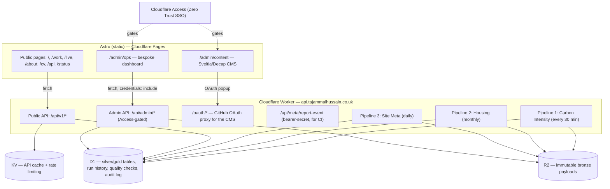

# Architecture

## System overview

Frontend and backend are deployed and scaled independently: the Astro site is static output on
Cloudflare Pages, the Worker is a single script handling every pipeline, every API route, and the
admin surfaces' backends.

## Medallion architecture (bronze → silver → gold)

Every pipeline follows the same three layers, implemented identically in
`worker/src/pipelines/{carbon,housing,meta}/`:

- **Bronze** (`lib/bronze.ts`): the raw response from the source, landed byte-for-byte in R2 and
  indexed in D1's `bronze_ingestion_log`. Nothing downstream ever reads live network data directly
  — everything reads back from bronze, so a crash mid-pipeline is always recoverable by re-running
  the transform against what already landed. Bronze is **never deduplicated**: every ingestion
  attempt, successful or not, gets its own immutable, timestamped object.
- **Silver** (`transform.ts` + `persist.ts`): bronze parsed, validated, and upserted into typed D1
  tables. Validation failures throw (`InvalidPayloadError` / `InvalidEventError`) rather than
  silently coercing bad data. Upserts are idempotent by construction (`ON CONFLICT ... DO UPDATE`
  on the natural key) — re-running the same ingestion never duplicates rows. The one exception is
  the meta-pipeline's `site_events_silver`, which is deliberately append-only (an event log has no
  natural upsert key).
- **Gold** (`aggregate.ts` + `persist.ts`): silver recomputed into the aggregates the public API
  and frontend actually read (daily averages, regional month-on-month change, etc.). Gold is always
  *recomputed from silver*, never a pass-through of a source API's own precomputed numbers — see
  `pipelines/housing/aggregate.ts`'s comment for why that distinction matters even when the source
  happens to publish the same figure.

Every run also executes five data-quality checks (`worker/src/quality/checks.ts`, pure functions;
`quality/run.ts` wires them to D1 per pipeline): **freshness**, **completeness**, **validity**,
**uniqueness**, **referential** integrity. Results — including failures — are persisted to
`data_quality_runs` and shown honestly on `/status`, never hidden.

## The three pipelines

| | Source | Schedule | Notes |
|---|---|---|---|
| **1. Carbon Intensity** | [api.carbonintensity.org.uk](https://api.carbonintensity.org.uk) (no key) | Every 30 min | Also supports on-demand **backfill** of up to 31 days of real history (matches the source API's own range limit) — see `runCarbonBackfill` and the "Backfill" form on `/admin/ops`. |
| **2. Housing** | [HM Land Registry UK HPI](https://landregistry.data.gov.uk/app/ukhpi) (no key) | Monthly, 1st at 06:00 UTC | Publishes with a ~2-month lag that varies; each run probes backward from the current month until it finds one that's actually published. Every probe — hit or miss — is logged to bronze. |
| **3. Site Meta** | This Worker's own D1 state | Daily at 05:00 UTC | Self-referential: takes a snapshot of every other pipeline's run history, recent quality-check failures, and admin audit activity. Real deploy/build events are added separately, in real time, by CI calling `POST /api/meta/report-event` right after an actual deploy — never fabricated on a schedule. |

## Database

`worker/migrations/0001_init.sql` is the authoritative schema. Per-pipeline silver/gold tables,
plus operational tables shared across all three pipelines:

- `bronze_ingestion_log` — index over R2, not the payloads themselves.
- `{carbon,housing}_readings_silver`, `{carbon,housing}_*_gold`, `site_events_silver` — per-pipeline
  silver/gold tables.
- `pipeline_runs` — every run's status, trigger type (`cron` / `manual` / `backfill`), row counts.
- `pipeline_config` — pause flags, staleness thresholds, admin-editable without a redeploy.
- `data_quality_runs` — every check result, every run, including failures.
- `admin_audit_log` — append-only; there is no delete or update path anywhere in the codebase.

## Public API

`worker/src/routes/api.ts` — read-only (GET), CORS-enabled for any origin, cached in KV
(`API_CACHE_TTL_SECONDS`, default 5 min — responses include `cacheHit` so callers can tell), rate
limited to 60 req/min/IP via a KV fixed-window counter that fails open on KV errors. Fully
documented, with real example responses, at `/api`.

## Admin surfaces

Two independent surfaces, two independent authentication mechanisms:

1. **`/admin/ops`** (`src/pages/admin/ops/`, backed by `/api/admin/*`) — pipeline pause/resume,
   run-now, carbon backfill, run/quality-check history, bronze payload inspection, and the audit
   log. Gated by **Cloudflare Access** (Zero Trust SSO) at the edge — the app never sees a
   password. `worker/src/lib/access.ts` verifies the `Cf-Access-Jwt-Assertion` against Access's
   JWKS; a documented dev-only bypass activates when `CF_ACCESS_TEAM_DOMAIN` is unset (i.e. nobody
   has configured Access yet), never in a real deployment. Every state-changing action writes to
   `admin_audit_log` via `recordAudit`, which has no corresponding delete function.
2. **`/admin/content`** (Sveltia CMS, `public/admin/content/config.yml`) — git-backed editing of
   case studies' structured fields, writing posts, ventures, and site settings. *Not* the same
   auth path: Access still gates reachability of the page itself, but writing to the repo needs a
   GitHub identity, handled by `worker/src/routes/oauth.ts` — a standard OAuth-popup proxy
   (the client secret can't live in a static site, so the Worker holds it). The CMS deliberately
   doesn't expose case studies' MDX *body* (the Mermaid diagram + `import` statement) as an
   editable field — a markdown widget isn't safe to hand-author JSX through.

## SEO

- JSON-LD: `Person` schema on every page (`BaseLayout.astro` — never omitted, per spec), `Article`
  + `BreadcrumbList` on writing posts, `BreadcrumbList` on case studies.
- `robots.txt` and the sitemap both exclude `/admin/*`.
- OG images (`scripts/generate-og-images.mjs`) are real, generated text cards (site name/tagline,
  or the actual case-study/post title) rendered via a headless browser at build time — not stock
  photography, not a fabricated screenshot.

## Deploying for the first time

Blocked on repo-owner action for: a real Cloudflare account, a registered domain pointed at
Cloudflare, a GitHub repository, and a GitHub OAuth App for the CMS. Once those exist:

1. `wrangler d1 create portfolio_db`, `wrangler r2 bucket create portfolio-bronze`,
   `wrangler kv namespace create CACHE_KV` — paste the resulting IDs into `worker/wrangler.toml`
   (currently `REPLACE_WITH_REAL_D1_ID` / `REPLACE_WITH_REAL_KV_ID`).
2. Create a Cloudflare Access Application covering `https://tajammalhussain.co.uk/admin/*` (and
   `https://tajammalhussains.uk/admin/*`, since that domain is also kept live), then
   `wrangler secret put CF_ACCESS_TEAM_DOMAIN` and `CF_ACCESS_AUD`.
3. Create a GitHub OAuth App (callback URL `https://api.tajammalhussain.co.uk/oauth/callback`), set
   `GITHUB_OAUTH_CLIENT_ID` in `worker/wrangler.toml` `[vars]` and
   `wrangler secret put GITHUB_OAUTH_CLIENT_SECRET`.
4. `wrangler secret put META_INGEST_SECRET` (any random string) — also add it as a GitHub Actions
   repository secret of the same name, plus `CLOUDFLARE_API_TOKEN` and `CLOUDFLARE_ACCOUNT_ID`.
5. Create the Cloudflare Pages project (`tajammalhussains-portfolio`, matching
   `.github/workflows/deploy.yml`) and point the domain at it.
6. Push to `main` — `.github/workflows/deploy.yml` runs the D1 migrations, deploys the Worker,
   builds and deploys the Pages site, then reports the deploy as a real event to the site's own
   meta-pipeline.
